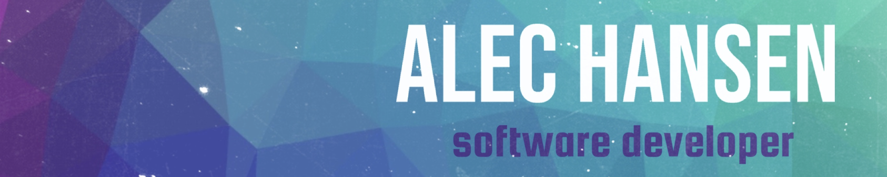

</img>

<h1>Hi, I’m Alec 👋</h1>

- ✍️ I'm actively contributing to a private project built in **React Native** and **TypeScript**. 
- 🌱 I’m dabbling in **Angular** and **Vue**! I want to know what the king of JavaScript is 👑
- 📫 Reach me via email at alecdhansen@gmail.com or on [LinkedIn](https://www.linkedin.com/in/alecdhansen/)
- 🧑🏻‍💻 I've got a site! Check me out over at www.alechansen.me

<h2>Languages I know ↓ </h2>

 <h2>Technologies I have used and love ↓ </h2>
 

<!--  -->

  
  
  
<!-- https://github.com/Ileriayo/markdown-badges -->

<!--  -->

